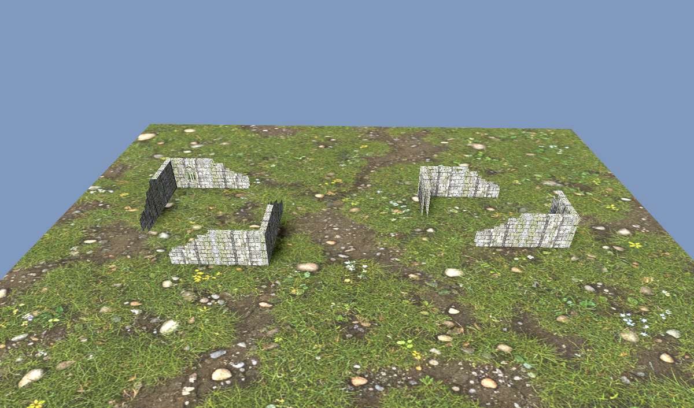

# Handoff — Ruin-wall texturing (OPR map generator)

> **Branch:** `claude/terrain-prop-textures` · **PR:** #48 · **Status:** DONE — the §6
> shell-wall integration was wired into `scripts/terrain_overlay.gd` on 2026-06-09 (R2
> panel delivery via `ruins_library.gd`, see §8). This document stays as the design
> record: the approved look, the art recipe, and the gotchas.

This is a complete handoff for continuing the ruin work on another machine. It records the
**approved look**, the **art + how it was generated**, the **wall layout** (done, tested),
a **reference renderer**, and a precise **integration plan with all the gotchas** so nothing
is re-discovered the hard way.

---

## 1. Goal & where we are

Replace the procedural blue "hologram" ruin props in the OPR auto-map generator with a
high-quality, generated **mossy stone ruin** look: thick, broken, see-through walls that
step down (crumble) toward their open ends, with the occasional Gothic window / doorway.

**Done & verified (this PR):**
- `scripts/terrain_prefabs.gd` — ruin walls are now **two point-symmetric L-corners** with a
  per-segment `role` taper. (Was a single full L.) Tests rewritten + green.
- The **approved art set** is archived on R2 at
  `https://assets.akesberg.de/terrain-source/ruins/*.webp` (kept off-git so the repo stays
  slim; the runtime `ruins_wall.webp` stays bundled).
- The **generation recipe** is captured as a runnable script:
  `tools/model_forge/generate_ruin_walls.py`.
- A committed **reference renderer** reproduces the approved look:
  `tools/render_ruin_walls.gd` (+ `_runner.tscn`). Output preview:
  `docs/images/ruin_walls_reference.png`.

**Pending (next agent):**
- Wire the shell-wall, multi-variant material into `scripts/terrain_overlay.gd`
  (`update_wall_models` / `_create_procedural_wall` / `_get_ruins_wall_material`), replacing
  the current single-triplanar box wall. **Section 6** is the step-by-step plan + gotchas.
- Decide texture-import settings for the alpha panels (scissor needs hard alpha edges).
- (Project-level, user-owned) publish terrain art via **R2** like the biomes — see §7.


*Left: 9×9″ (3×3) ruin. Right: 9×6″ (3×2). Two opposite L-corners, medium mossy masonry,
stepped crumble to the free ends, shell-thickness walls. Rendered by `render_ruin_walls.gd`.*

---

## 2. The approved look (decisions locked with the user)

These were iterated with the user and **explicitly approved** ("ja. das ist unser
Arbeitsstand."). Do not silently revert them:

1. **Stone scale = MEDIUM** (~6 stones across a cell). "Fine" looked like gravel; "large"
   looked like boulders. Both were rejected.
2. **Dirty / mossy**: green moss + lichen, grime, water staining, soil in the recessed
   joints. Clean stone was rejected.
3. **No drawn lines / no "CAD" overlay.** The stone structure comes from the photo itself.
   The damage grid is used only to decide which whole stones to remove — it is **never
   drawn** onto the texture.
4. **Walls have thickness** and are rendered as **shells** (front + back face + plain-stone
   thickness caps), not single planes and not solid boxes with the window wrapped onto the
   sides. This was the fix for window-texture artifacts bleeding onto box edges.
5. **Crumble / "abbröckeln"**: from each corner the wall **steps down** toward the open
   ends, stone-by-stone (stepped, not jagged zig-zag).
6. **Openings**: see-through **doorway** holes and an inset **two-light Gothic window**.
   The window uses the **same masonry** as the wall (colour-harmonised) and is **inset**
   (~70–97% of the panel), not a separate sandstone object.
7. **Course alignment**: neighbouring cells must line up — same masonry source, bottom-
   anchored, identical UV scale (all panels are 0..1 UV, same pixel size). A regression
   where panels had mismatched stone sizes / lost the stepped taper was caught and fixed.

---

## 3. The source art set — R2 `terrain-source/ruins/`

Archived on R2 at `https://assets.akesberg.de/terrain-source/ruins/<file>` (not bundled —
fetch on a GPU machine for the finishing pass). All 800×720 WebP (≈ the 3″×2.5″ wall-cell
aspect). Alpha = see-through (knocked-out stone).

| File | Mode | Role |
|---|---|---|
| `solid_a.webp` | RGB | Full wall, masonry A |
| `solid_b.webp` | RGB | Full wall, offset variant (so neighbours don't repeat) |
| `topdmg_a.webp` | RGBA | Full wall with the top course knocked out |
| `opening_a.webp` | RGBA | Doorway column removed (see-through) |
| `crumble_a.webp` | RGBA | Stepped taper, full → ⅔ height |
| `crumble_b.webp` | RGBA | Stepped taper, ⅔ → ⅓ (continues `crumble_a`) |
| `crumble_steep.webp` | RGBA | Stepped taper, full → ⅓ in one cell (short arms) |
| `window.webp` | RGBA | Inset two-light Gothic window; glazed lights are see-through |
| `normal.webp` | RGB | Tangent-space normal baked from the masonry luminance |
| `masonry_source.webp` | RGB | 2048² source sheet; everything else is derived from it |

The crumble texture **descends toward its +U (right) edge** — i.e. the low/free end is on
the right of the image. This matters for the flip rule (§5, §6).

---

## 4. How the art was generated — `tools/model_forge/generate_ruin_walls.py`

One reproducible pipeline; re-deriving the PIL panels from the masonry is free.

- **Model:** Gemini 3 Pro Image ("Nano Banana Pro", `gemini-3-pro-image`) via `google.genai`,
  `GenerateContentConfig(response_modalities=["IMAGE"], image_config=ImageConfig(aspect_ratio=…, image_size="2K"))`.
  **Returns RGB, no alpha** — alpha is added by us.
- **Masonry** (1 render): "seamless tileable top-down … MEDIUM coursed grey stone … ~6 stones
  across … moss/lichen, grime, soil in recessed joints … no drawn lines, no grid". → `masonry_source`.
- **Window** (1 render + PIL): a front-on two-light Gothic tracery window where the **glazed
  lights are flat magenta (255,0,255)** and the **surround is flat green (0,255,0)**. PIL
  **chroma-keys** it: magenta `R>150 & G<95 & B>150` → see-through; green → cropped; stone =
  the rest, eroded with `MinFilter(7)` to bite off the key fringe; then the window stone is
  colour-harmonised to the wall mean and inset on a solid masonry panel. → `window` (RGBA).
- **Variants** (PIL, from the masonry): a jittered block grid (medium: `H/11` × `W/6`) used
  only to remove whole stones into the **alpha** channel (top damage, doorway, crumble taper)
  + an offset (`np.roll`) variant. The grid is **never drawn**.
- **Normal** (PIL): luminance → Gaussian blur 1.0 → gradient → encode (strength ≈ 3.5).

**Cost / billing note:** the user spent **~€200** on Gemini image generation during this
work — regenerate sparingly. The committed WebP set is authoritative; you usually only need
`--only variants` (free, no API) if you tweak the breakage. For 3D model work, TRELLIS runs on
a **HuggingFace GPU Space billed per-hour** (it auto-sleeps; there is a wake routine) — that's
the cheaper lever than re-rolling Gemini.

**Secrets:** the Gemini key lives in `tools/model_forge/.gemini_key` (git-ignored) or the
`GEMINI_API_KEY` / `GOOGLE_API_KEY` env var. A key was pasted into chat during the session —
**rotate it.** Never commit keys.

---

## 5. Wall layout — `scripts/terrain_prefabs.gd` (DONE, tested)

`wall_segments_for(prefab, origin, rotation, flip)` now returns **two point-symmetric
L-corners** (not one big L). For a footprint of `size = (X, Y)` cells:

- **NW corner** — north edge on cols `0..X-2`, west edge on rows `0..Y-2` (free ends toward
  **+X / +Z**).
- **SE corner** — south edge on cols `1..X-1`, east edge on rows `1..Y-1` (free ends toward
  **−X / −Z**).

So each arm is `size−1` cells; the centre and the two opposite corners stay open. This
matches the OPR auto-map ruins (a 9×9″ ruin has 6″ legs per side, mirrored). Counts: 3×3 → 8
segments, 3×2 → 6.

Each segment carries a **`role`** from `_crumble_role(dist_from_corner, arm_len)`:
`dist==0 → "full"`; `arm_len==2 → "crumble_steep"`; `dist==arm_len-1 → "crumble_b"`;
`dist==arm_len-2 → "crumble_a"`; else `"full"`. The taper descends toward the free end.

`rotation`/`flip` are handled by `_transform_cell` / `_transform_edge` and covered by tests
(`test/terrain_prefabs_test.gd`): two-opposite-corners, shared origin corner, roles
(3×3 → 4×"full" + 4×"crumble_steep"), rotation keeps all four edges within the rotated bbox,
flip changes the layout. **Full suite: 256 tests green.**

> Segments currently emit `{edge_cell, edge_side, wall_key=PROC_WALL_KEY, length_inches,
> sub_position, role}`. The renderer needs to know **which way each crumble panel tapers**
> (see §6 gotcha #1). Cleanest fix: also emit a free-end hint here (it survives the
> rotation/flip transform like edges do).

---

## 6. Integration plan — `scripts/terrain_overlay.gd` (PENDING)

### Current state (PR #48, first pass — still live)
- `_get_ruins_wall_material()` → one `StandardMaterial3D` with `ruins_wall.webp`,
  **world-triplanar**, `STONE_TILE_METERS = 0.085`.
- `_create_procedural_wall(len, height)` → a **solid `BoxMesh`** (height `WALL_HEIGHT_INCHES =
  2.5″`, thickness `0.25″`) + matching `BoxShape3D` collision; placed by `update_wall_models`
  per `wall_segment`, with `_add_wall_corner_pieces` at intersections.
- Constants: `INCHES_TO_METERS=0.0254`, `GRID_SIZE_INCHES=3.0`, `WALL_HEIGHT_INCHES=2.5`,
  `WALL_THICKNESS_INCHES=0.25`, `CORNER_SIZE_INCHES=0.25`, `Z_FIGHT_OFFSET=0.002`,
  `_EDGE_DELTA = [N(0,-1), E(1,0), S(0,1), W(-1,0)]`.

### Target (this work) — shell walls + per-role panels
Reproduce `tools/render_ruin_walls.gd` inside the live renderer. Per `wall_segment`:
1. **Pick the panel** from `segment.role`:
   `"full"` → random of `solid_a/solid_b/topdmg_a` (5% `window`, 20% `opening_a`);
   `"crumble_steep"|"crumble_a"|"crumble_b"` → the matching texture.
2. **Build a SHELL** (not a box): front + back `QuadMesh` (3″ × 2.5″) with the panel material;
   for non-crumble panels add a plain `solid_a` **top cap** (and, for the window, plain caps
   on the thickness sides so the reveal shows stone). Thickness ≈ `0.4″` reads better than
   `0.25″`.
3. **Material** = `StandardMaterial3D`: `albedo = panel`, `normal_texture = normal`,
   `normal_scale ≈ 1.4`, `roughness ≈ 0.93`. For any panel with holes (everything except
   `solid_*`): `TRANSPARENCY_ALPHA_SCISSOR`, `alpha_scissor_threshold = 0.5`,
   `cull_mode = CULL_DISABLED`. Cache materials by `(panel, flip)`.
4. **Collision stays a full-height Impassable box** (OPR: ruin walls are Impassable). Keep the
   existing `StaticBody3D` + `BoxShape3D` at full `WALL_HEIGHT_INCHES`; only the **visual**
   becomes a shell. Don't let the crumble/holes change the collision.

### Gotchas (each cost real time — do not rediscover)
1. **Crumble direction / mirror-flip (the #1 trap).** The crumble texture steps down toward
   its **+U (right)** edge, so each arm's panel must be U-flipped (`uv1_scale.x = -1`) iff its
   local +U does **not** already point to the arm's free end. In the canonical unrotated piece
   the reference tool uses: **N arm → no flip, W arm → flip, S arm → flip, E arm → no flip.**
   This must be re-derived against `terrain_overlay`'s quad orientation (its wall_y_rotation is
   N=0, E=+90°, S=180°, W=−90°, **then** `− grid_rotation`) and composed with the piece's
   own `rotation`/`flip`. **Recommended:** emit a free-end direction from `wall_segments_for`
   (transformed with the cell, like edges are) and flip from that — far more robust than
   reverse-engineering the matrix. **Verify visually on GPU.**
2. **Shell, not box, for openings.** A solid box with an alpha window wraps the window texture
   onto the side faces → ugly. Front+back planes + **plain-stone caps** fixed it.
3. **Course alignment.** All panels share the masonry source, are bottom-anchored, and use the
   **same 0..1 UV scale** (do *not* mix triplanar-scaled and 0..1-scaled panels — that's what
   made stone sizes mismatch). Quads use the texture's own UVs directly.
4. **Alpha import.** Scissor needs **hard** alpha edges. Import the RGBA panels
   (`topdmg/opening/crumble*/window`) **lossless / without lossy VRAM compression**, or the
   threshold will fray. The `_load()` in the reference tool sidesteps this by decoding the
   WebP bytes directly (`load_webp_from_buffer`) — fine for a tool, but in-game prefer correct
   import settings.
5. **Multiplayer determinism.** `terrain_overlay` is multiplayer-synced and walls derive from
   the synced `wall_segments`. The per-cell "full" random pick **must be deterministic** from
   stable inputs (e.g. seed an RNG from `edge_cell` + `edge_side`), or clients will show
   different windows/openings. Don't use an unseeded/global RNG.
6. **Window = same masonry.** Already baked into `window.webp` (harmonised). Keep it inset; do
   not swap in a separate sandstone asset.
7. **Fallback.** Keep a graceful fallback (current triplanar `ruins_wall.webp`, or the hologram
   material) if the new textures fail to load, so the build never breaks mid-migration.

---

## 7. Reference renderer + verification

`tools/render_ruin_walls.gd` (+ `tools/render_ruin_walls_runner.tscn`) renders a 3×3 and a
3×2 ruin with the **exact** shell/role/flip logic the game should use, to
`renders/ruin_walls_reference.png`.

**No GPU (software GL, Mesa llvmpipe via xvfb):**
```bash
xvfb-run -a -s "-screen 0 1700x1000x24" "$GODOT" \
  --display-driver x11 --rendering-driver opengl3 --audio-driver Dummy \
  --path . res://tools/render_ruin_walls_runner.tscn
```
**On GPU:** drop the xvfb wrapper; run the runner scene from the editor or headless. Use this
to confirm the **crumble-flip** and window look once you wire the material into the game.

> `GODOT` here = the project's Godot 4.6 binary. In the web container it's at
> `~/.local/share/godot/godot` (provisioned by `.claude/hooks/…`); `$GODOT_BIN` is exported.

Validate the same way every change is validated (`docs/DEVELOPMENT.md`): import/compile
(`godot --headless --editor --quit`) + the gdUnit4 suite
(`-s -d res://addons/gdUnit4/bin/GdUnitCmdTool.gd --ignoreHeadlessMode -a res://test`).

---

## 8. Asset delivery (RESOLVED: on-demand from R2)

The runtime panel set is delivered **on-demand via Cloudflare R2**, mirroring the biome
ground textures: `assets/ruins_manifest.json` maps the 9 runtime panels (everything except
`masonry_source`) to `https://assets.akesberg.de/terrain-source/ruins/<file>` with sha256
integrity; `scripts/ruins_library.gd` + `AssetDownloadManager` cache them in
`user://ruins_cache`. The WebPs stay **out of git** (`assets/terrain/props/ruins/` is
gitignored; the repo history was scrubbed of binaries on 2026-06-09 — do not commit them
back). The renderer keeps the first-pass triplanar material as offline fallback and
upgrades in place once the download lands. Runtime decode via `load_webp_from_buffer`
preserves the authored hard alpha (so §6 gotcha #4 needs no import settings).

---

## 9. Related / repo context

- **PR #48** (this branch, `claude/terrain-prop-textures`): ruin walls — layout + art + recipe
  + reference renderer (this work).
- **PR #47** (`claude/dazzling-cray-6rj627`): biome **ground** textures (the 6 biomes in
  `assets/terrain/biomes/`), awaiting the user's R2 publish. **Keep separate** — do not push
  ruin work there.
- `tools/model_forge/generate_battlemaps.py` was intentionally reverted by the user to its
  original (Nano-Banana) form; leave it.
- There is **no AI / battle-simulation system** (removed); don't recreate it.

## 10. Quick start for the next agent
1. Read this file + look at `docs/images/ruin_walls_reference.png` (the target).
2. Run the reference renderer (§7) to see it live and confirm the crumble-flip on GPU.
3. Port the shell/role/flip logic from `tools/render_ruin_walls.gd` into
   `scripts/terrain_overlay.gd` per §6 (keep collision = full box; mind the gotchas).
4. Re-render + run the gdUnit4 suite; commit on `claude/terrain-prop-textures`; update PR #48.
