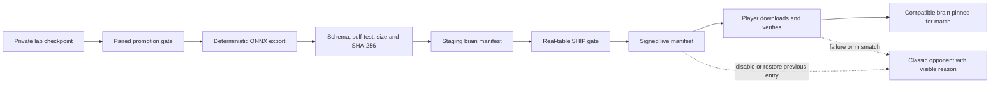

# AI iteration rollout workflow

Status: proposed; verified against `origin/main` at `670166abafaf8778f79c030241ad805fc9f3c523` (2026-09-04).

## The picture in plain words

A promoted training checkpoint is not yet a game opponent. The game first needs a thin, playable neural bridge: a versioned export, CPU inference inside the Rust GDExtension, and the existing search consuming policy logits and leaf values behind an explicit switch. After that, a release-independent, signed brain manifest can point compatible builds at an immutable, hash-addressed brain. Publication is allowed only after the exported bytes reproduce fixed laboratory decisions and beat the currently shipped classic opponent on the real Godot table. A match pins one brain hash until it ends; incompatibility, download failure, a kill switch, or rollback selects the classic opponent with a visible explanation. Optional human-game sharing is a separate, default-off consent path and is never a prerequisite for playing.

## Verified starting point

- The game is `0.3.12.0-alpha` (`project.godot:19`). Tag pushes run gdUnit, relay, and Rust gates before the release job; alpha/beta tags become prereleases (`.github/workflows/build.yml:185-202`). The update checker compares GitHub releases and fails open when offline (`docs/UPDATE_CHECK.md:21-35`).
- Live model manifests already overlay a bundled fallback, support a staged override, and retain the fallback on network or parse failure (`scripts/model_library.gd:407-455`). Asset downloads use content hashes, temporary files, retry/timeout handling, and rename only after SHA-256 verification (`scripts/asset_download_manager.gd:61-78`, `scripts/asset_download_manager.gd:180-203`). AI army lists also use CDN plus local cache, but that text path has no hash verification and must not be copied for executable model input (`scripts/main.gd:14283-14305`, `scripts/main.gd:14324-14356`).
- The Rust search is optional and default-off; a missing extension or declined activation falls back to GDScript (`scripts/solo/battle_sim.gd:66-83`, `scripts/solo/solo_controller.gd:3102-3115`, `scripts/solo/solo_controller.gd:3198-3230`). The core already exposes candidate-logit and batched leaf-value seams to Python (`core/nml-core-py/src/lib.rs:1189-1208`), but the Godot bridge exposes neither, and its dependencies contain no inference runtime (`core/nml-core-godot/Cargo.toml:11-14`).
- A Rust formation/movement solver exists (`core/nml-core/src/mv/plan.rs:1-24`, `core/nml-core/src/mv/entry.rs:37-48`), but the stronger game-side joint move-and-target position solver still runs only in GDScript and is skipped when the planner owns the action (`scripts/solo/solo_controller.gd:2015-2024`, `scripts/solo/solo_controller.gd:2073-2087`, `scripts/solo/solo_controller.gd:3956-4053`). Its port/parity gate is therefore a public-shipment dependency.
- The GDExtension template is Linux-x86_64-only and inert by default, while every export preset excludes `core/*`; release builds do not yet contain the Rust player (`core/nml_core.gdextension.in:7-18`, `export_presets.cfg:9-12`, `export_presets.cfg:51-54`, `export_presets.cfg:123-126`).
- The core's current rules epoch is 3 (`core/nml-core/src/acts.rs:242-271`), but the live act header does not stamp `rules_epoch`; the Godot reader consequently uses the legacy default 0 (`scripts/solo/act_recorder.gd:215-255`, `core/nml-core-godot/src/plain.rs:931-935`). This must be fixed before a neural result can claim current-rule play.

## 1. Unit of shipment

**Counter-argument first:** Treating every brain as a game release gives the strongest binary/runtime lock and an offline copy, while remote model files enlarge the parser and supply-chain attack surface.

**Recommendation:** Ship a brain as a signed, immutable asset by default; ship a new game release whenever the ONNX/operator contract, token schema, core ABI, rules epoch support, or inference runtime changes. Never hot-swap during a match.

The compatibility tuple is `(brain_schema, token_schema, onnx_opset, operator_allowlist, core_abi, min_game_version, max_game_version, rules_epoch, supported_systems)`. The manifest may select a brain only when every field matches. The blob is capped before download, SHA-256 checked before parsing, and its embedded self-test rerun before activation. Unknown operators, shapes, epochs, signatures, or versions are hard rejections. On any rejection the setup screen says why and offers **Classic**; the battle log writes the selected public label and short hash. It must never silently claim **Neural N** while classic code is playing.

Keep at least the classic opponent in every build. Preserve all published brain blobs at their content-addressed URLs so saved matches can reacquire an exact hash. A release may additionally bundle the current compatible brain for first-run/offline convenience, but the signed live manifest remains the rollout and rollback authority.

## 2. The bridge into the game

**Counter-argument first:** ONNX Runtime adds native binaries and cross-platform release work; a custom Rust forward would be smaller but would create a second transformer implementation to validate forever.

**Recommendation:** Export fixed-shape ONNX and run it in `nml-core-godot` with a pinned, CPU-only ONNX Runtime; extend the Godot search call to build the core's canonical tokens, batch candidate logits and leaves, and pass them through the existing Rust seams.

The first vertical slice loads a local `.onnx` path only when `NML_NEURAL_BRAIN_PATH` is set, exposes a **Classic / Neural (experimental)** developer switch, and completes real-table games. It must include the extension's decision in the battle log and must fail loudly back to Classic. The production switch belongs in the solo setup/AI opponent panel, not an environment variable. The existing difficulty wire reaches each AI slot (`scripts/main.gd:1794-1815`, `scripts/main.gd:14359-14374`); replace its player-facing identity with a neutral engine choice rather than adding another persona.

Before public shipment, port or faithfully expose the joint position solver to the Rust candidate/token path and gate its destinations against fixed real-table fixtures. The current Rust movement solver is necessary but not sufficient: it legalises a chosen move; the GDScript position solver chooses useful move/target combinations. Also stamp `rules_epoch` in the live header and reject any search decline during a SHIP run.

Rule gaps block a brain for a match when they can change candidate legality, movement/position/LOS, combat or spell resolution, state transitions, objective scoring, or target/action ordering for any unit on that table. Purely visual/text-only rules, and rules absent from the brain's declared supported systems and test fleet, need not block publication. At setup, an allowlist census must either prove every decision-relevant rule is supported at the selected epoch or disable Neural with the exact unsupported rule names. “Known but approximated,” a non-empty core `unknown_rules`, or any fallback/decline is not support.

## 3. Promotion to publication

**Counter-argument first:** Reusing the live asset manifest and uploading by hand is quick, but it makes evidence, compatibility, and rollback conventions rather than enforced state.

**Recommendation:** Add one idempotent coordinator command, `tools/publish_ai_brain.py --candidate <checkpoint> --channel staging|live`, which refuses to advance unless it can verify every artifact and signed gate receipt below.

1. Import the promotion receipt: previous brain hash, fresh paired seeds, both seats, wins/losses/draw policy, `n >= 600`, win rate `>= 55%`, sign-test `p < .05`, lab commit and corpus-generation digest.
2. Export deterministically to a pinned ONNX opset with static dimensions and the small operator allowlist; strip training state and free-form metadata. Re-export twice in clean processes and require identical canonical model digests.
3. Produce a neutral record: `brain_id`/label (for example `brain-0003` / **Neural 3**), SHA-256, byte size, schemas/opset/operators, core ABI and game range, rules epoch/systems, training-corpus generation (not a private path), export commit/date, self-test vectors, and numeric gate receipts.
4. Upload the content-addressed blob and metadata to a non-live staging prefix; write a signed staging manifest. Never mutate an existing hash key.
5. From a clean exported game, download that staged blob. Require load/self-test success, exact logits/values and decisions on fixed lab fixtures, then complete 20 smoke seeds without a decline, crash, NaN, timeout, or classic fallback.
6. Run the pre-registered real-table SHIP gate against the currently shipped Classic opponent: 600 fresh paired Godot games with seats swapped, `>= 55%` and sign-test `p < .05`; archive result, seeds, logs, game/core commits, manifest and brain hashes.
7. Run the checks in section 6. With two-person review of the evidence and manifest diff, atomically update the signed live manifest's channel pointer. The command reads back the live object and verifies its signature/hash before reporting success.
8. A clean player build must fetch, identify, pin and play the live brain. Publication ends only when that receipt is archived.

The brain manifest is separate from visual assets and AI-list text. It has `schema`, `issued_at`, `key_id`, `signature`, `channels.{beta,stable}`, immutable brain records, and an `enabled` kill switch plus `reason`. Signing keys never live in CI logs or the repository; clients carry only public verification keys.

## 4. Rollout, rollback and kill switch

**Counter-argument first:** Percentage rollout finds broad hardware failures sooner, but it needs stable cohorting or produces a different opponent on every launch; either outcome complicates privacy and reproducibility.

**Recommendation:** Use an explicit **Neural Beta** channel first, then move the same hash to stable after the beta observation window; do not use percentage rollout initially.

Show **Classic**, **Neural N (Beta)**, and **Neural N** in setup with release notes and download size. Do not interrupt a player with a try-it prompt. Resolve the manifest only before setup, pin `{brain_id, hash, core_abi, rules_epoch}` at match start, and show the same tuple in game info plus one battle-log line.

Rollback is an atomic signed-manifest pointer change to the previous immutable record. Emergency stop sets `enabled:false`; clients retain the blob but will not select it for a new match. A match already underway stays pinned unless the issue is security-critical; for that exceptional case, stop neural turns, explain the kill switch, and require an explicit choice to continue with Classic or quit. Cache the last-known-good signed manifest so a malformed/new manifest cannot erase a working offline choice.

## 5. Determinism, saves, multiplayer and resources

**Counter-argument first:** Exact floating-point equality across three operating systems may cost throughput and may still be weaker than recording the decision actually taken.

**Recommendation:** Make the inference path as deterministic as practical and make records authoritative: CPU provider only, one inference thread, pinned runtime/settings, no exploration, fixed shapes, output quantisation before stable index tie-breaks, golden vectors on every release platform, and recorded chosen actions for replay.

Save `{engine: classic|neural, brain_id, hash, schemas, core_abi, rules_epoch}`; bump the save format and add a migration/fixture, following the existing versioned contract (`scripts/save_manager.gd:10-12`, `scripts/save_migrations.gd:20-54`). On load, reacquire the exact immutable hash. If unavailable, do not continue under another brain silently: show **Retry download / Continue with Classic / Cancel** and record the choice.

Neural play is solo-only at first and disabled whenever multiplayer is active. This avoids peers making different choices even though current multiplayer already rejects game-version mismatches (`scripts/network_manager.gd:357-370`). A later multiplayer milestone must make the host authoritative, send the chosen action and brain hash, extend the handshake, and run the two-instance harness before enabling it.

Initial budgets on the designated weak reference laptop: brain download `<= 8 MiB`; incremental inference RSS `<= 96 MiB`; neural inference p95 `<= 100 ms` and max `<= 500 ms` per activation (search time reported separately); load `<= 2 s`. Reject over-cap dimensions before allocation. A watchdog failure is visible and recorded; repeated failure disables Neural for the rest of that match. Final numbers may tighten after M1 measurement, never loosen silently.

## 6. Publication verification

**Counter-argument first:** The full real-table fleet is expensive and unsuitable for every ordinary PR, while CI cannot access private checkpoints or fixtures by default (`.github/workflows/rust.yml:37-45`).

**Recommendation:** Split fast public CI from a mandatory, signed maintainer publication receipt; a brain cannot go live merely because public CI is green.

Public CI runs Rust unit/workspace tests, ONNX schema/operator/shape/self-test tests with a tiny public fixture, GDExtension build, pure compatibility/manifest/signature tests, downloader hash/mismatch/offline/kill-switch tests, save migration tests, gdUnit, relay tests, and Linux/Windows/macOS golden inference vectors. Release CI already makes Rust, gdUnit and relay tests prerequisites (`.github/workflows/build.yml:176-195`); extend that dependency when the extension ships.

Before every publication the coordinator additionally runs: double-export reproducibility; fixed checkpoint-versus-ONNX decisions; exported-game staging smoke; rules/decline census; the 600-pair real-table SHIP gate; headless never-worse/replay-fidelity sweeps; weak-laptop load/memory/latency measurement; malformed and over-size model rejection; one rendered match per supported system plus spot checks of movement, shooting, charge, spell and save/resume. Run the two-instance harness only if multiplayer code, wire/save state shared with multiplayer, or the multiplayer neural lockout changed.

Measured real-table planning costs are materially larger than unit-test costs. On the current 16-vCPU reference box, a headless Godot game has a 453 s median and 586 s mean (use the mean for budgets) and consumes about 3.1 GiB RSS. Plan for roughly six concurrent 1,000-point workers per box and roughly four at 2,000 points. The farm `WORKERS` default can over-subscribe memory, so the runner needs an explicit RAM limiter. `farm/bootstrap_box.sh` installs Godot 4.6; Rust-only fleets use the no-Godot bootstrap. A 600-game SHIP gate is therefore about 16 box-hours, or approximately €2–9 when spread over 3–8 boxes at current commodity rates. The `--headless` mode degrades the deployment-physics probe (`tools/arena_match.gd:13-14`); this is an accepted fleet deviation, while rendered spot checks remain mandatory.

## 7. Ordered PR-sized milestones

**Counter-argument first:** Starting with manifests or automation would demonstrate delivery sooner, but it would deliver a road with no playable vehicle.

**Recommendation:** M1 is the playable bridge; publication machinery follows only after a real neural opponent can finish games behind a flag. Keep later items reviewable and PR-sized; M1 is explicitly larger because the bridge crosses Rust, GDExtension, Godot and packaging seams.

1. **M1 — Playable neural bridge (700–1,200 lines):** Linux developer build, local ONNX fixture, CPU inference in `nml-core-godot`, candidate/leaf seams, `NML_NEURAL_BRAIN_PATH`, visible label/hash/fallback, and one real-table smoke. This proves playability, not ship readiness; the game-side joint position solver remains an explicit blocker.
2. **M2 — Position and epoch parity (250-300):** connect/port joint position candidates, stamp current `rules_epoch`, make unknown rules/declines machine-readable, and gate fixed positions. No public toggle while this is red.
3. **M3 — Brain contract and loader (220-280):** pure metadata/compatibility validator, signed-manifest verification, size/operator allowlists, hash cache, self-test, last-known-good selection and tests.
4. **M4 — Linux export packaging (180-250):** build/install the extension and runtime into the Linux export; prove the packaged game loads the fixture although current presets exclude `core/*`.
5. **M5 — Windows packaging (180-250):** cross-build/package DLLs and run Windows golden/load smoke.
6. **M6 — macOS packaging (200-300):** universal library/runtime packaging, signing/export integration and macOS golden/load smoke.
7. **M7 — Solo UI and save pin (220-300):** Classic/Neural choice, compatibility reason, active label/log line, brain tuple in save format and migration; hard multiplayer lockout.
8. **M8 — Staging and publisher (250-300):** staging/live manifests, coordinator command through staged upload/read-back, receipts and dry-run; no live mutation in tests.
9. **M9 — Gates and rollback drill (250-300):** exported-artifact fixtures, real-table SHIP orchestration, kill switch, previous-pointer rollback and clean-client acceptance receipt.
10. **M10 — Consent and example preview only (250-300):** privacy menu, exact field list, pure allowlist payload builder, an honestly labelled committed example preview and local example JSON export; no human-game record, upload code or collector exists yet.
11. **M11 — Faithful human-game record (220-300):** collect a bounded, ordered record from central live-game seams, including observed dice rather than reconstructed randomness. Preview and local export may say “your last game's data” only once this record exists; explicitly list decisions or intent that the game cannot observe.
12. **M12 — Minimal collector (220-300):** separately deploy the write-only, size-capped, rate-limited quarantine endpoint plus schema/hash/deletion tests; do not add a game client yet.
13. **M13 — Per-game send (220-300):** add client upload, per-game veto, deletion request and zero-network-off tests. It cannot ship until the privacy notice and controller facts are published.

## 8. Public naming

**Counter-argument first:** Internal labels are convenient when comparing lab charts with player reports, but they leak private vocabulary and turn experiments into accidental product promises.

**Recommendation:** Repository and player surfaces use only neutral, stable identifiers: **Classic**, **Neural 3**, **Neural 3 (Beta)**, and `brain-0003`; private checkpoint aliases and filesystem paths are rejected by the export metadata linter.

The public metadata contains only reproducible technical provenance: corpus generation/digest, commits, dates and gate numbers. The linter scans manifest labels, model metadata, logs, fixtures, UI strings and PR artifacts against a private denylist without printing denied words.

## 9. Explicit opt-in sharing of de-identified game records

**Counter-argument first:** Human games are unusually valuable, but alpha volume is too small to justify covert telemetry, and the current lab recorders are not a safe upload format: they are environment-gated and include unit/weapon names (`scripts/solo/act_recorder.gd:3-14`, `scripts/solo/battle_sim.gd:1766-1781`).

**Recommendation:** Build a new allowlist-only payload from the faithful game record, use it primarily for evaluation and blind-spot discovery and only secondarily for separately consented training, and send nothing without both a global explicit opt-in and a per-game Share action. Consent and payload boundaries ship first with an honestly labelled example; the human-game record follows as a separate milestone before any upload path.

### Consent and UI

Place **Settings > Privacy & data > Help improve the computer opponent** beside the existing local diagnostics/export affordance, not in Terms or game setup. Ask once after the first completed game; **No thanks** is equally prominent, records the choice locally, and suppresses future prompts. The setting remains off until the player reviews the details and presses **Allow evaluation sharing**; **Allow use for training** is a separate default-off toggle. Withdrawal is in the same screen and immediately blocks all future requests. This follows the requirement that consent be freely given, specific, informed, unambiguous and as easy to withdraw as to give ([EDPB Guidelines 05/2020](https://www.edpb.europa.eu/our-work-tools/our-documents/guidelines/guidelines-052020-consent-under-regulation-2016679_en); [GDPR Articles 7, 13 and 17](https://eur-lex.europa.eu/eli/reg/2016/679?exec=1ba4110&irpid=irpid)).

Suggested English: **“Help improve the computer opponent? May Niemandsland send de-identified records of games you choose to share to the developer for evaluation? They contain board setup, armies, actions, dice, result, and game/brain versions. They never contain player names, chat, room codes, account/device identifiers, or save files. Review the exact fields and an example of exactly what we would send.”** Buttons: **No thanks** / **Review details**; only the detail page has **Allow evaluation sharing**.

Suggested German: **„Computerspieler verbessern? Darf Niemandsland pseudonymisierte Daten aus Partien, die du einzeln freigibst, zur Auswertung an den Entwickler senden? Enthalten sind Spielfeldaufbau, Armeen, Aktionen, Würfel, Ergebnis sowie Spiel- und Gehirnversion. Niemals enthalten sind Spielernamen, Chat, Raumcodes, Konto-/Gerätekennungen oder Spielstände. Prüfe vor deiner Entscheidung alle Felder und ein Beispiel dessen, was genau gesendet würde.“** Buttons: **Nein, danke** / **Details prüfen**; only the detail page has **Auswertung erlauben**. “Pseudonymised” is the honest legal description because the random deletion code links one installation's submissions.

Beginning with the faithful human-game record milestone, an opted-in game may show a quiet **Share this game?** card with **Keep private** focused by default, **Preview**, and **Save locally**. There is no Share button until the per-game-send milestone. Dismissal means no. Never queue or retry a vetoed game. Changing the payload schema, purposes, recipient, retention, or deletion behavior invalidates old consent and requires a fresh explicit choice.

### Exact payload and exclusions

Until the faithful human-game record milestone lands, the preview renders the canonical bytes produced by the real builder from a committed example fixture and labels them **Example**, never “your last game.” Once that record exists, the preview renders the canonical JSON bytes of the actual last completed game. The allowlist contains: payload/consent schema versions; random per-install deletion code and per-game record UUID; game version/build, core ABI, rules epoch; public brain id/hash or Classic; game system and mission/scoring identifiers; table dimensions; terrain/objective types and coordinates; random/layout/dice seeds; armies as stable book/unit/rule identifiers plus numeric stats and loadouts; ordered activations/actions, model coordinates, targets and observed dice faces; rounds, final objective/VP state and outcome; payload SHA-256. Use no free-text field and never reconstruct RNG state to fill gaps.

Never include player/army/unit custom display names, chat, battle-log prose, room code, multiplayer identity token, platform/account/device identifiers, IP address in stored payload/logs, save files, screenshots, filesystem paths, hardware inventory, or unrelated diagnostics. The current save contains timestamps and army names (`scripts/save_manager.gd:37-56`) and the lab profile contains names, so neither raw file may be uploaded. The existing diagnostics scrubber is useful precedent but not sufficient for this structured boundary (`scripts/diagnostics_reporter.gd:25-55`, `scripts/diagnostics_reporter.gd:73-98`).

Show the deletion code, destination/controller, processor and hosting region, purposes and separate toggles, exact retention, recipients, withdrawal/deletion steps, contact, privacy notice and supervisory-authority route before consent. Recommend 90 days for raw/quarantine records; replayable fixtures keep provenance and are deleted/tombstoned with their source before future datasets. The maintainer supplies and reviews the privacy notice/imprint and decides, with legal advice, how deletion affects already trained/published models.

### Transport and developer-side use

Use a separate HTTPS collector whose only public operation accepts a schema-valid, compressed, `<= 2 MiB` record with declared SHA-256. It applies edge rate limits without application IP logging, rejects free text/unknown fields, writes to a separate quarantined bucket, and returns no read/list capability. Do not reuse the multiplayer relay: that couples records to rooms/sessions. Do not issue direct upload credentials for the asset-delivery bucket: signed uploads still require a credential service and mix untrusted writes with trusted distribution.

The random 128-bit deletion code is a bearer capability, generated locally and shown/exportable to the player; the collector indexes it solely for deletion and never receives the multiplayer identity token. Providers may see an IP transiently to transport/rate-limit the request; configure logs off or shortest feasible retention and state the processor's actual behavior in the notice.

Received records move through: quarantine -> schema/hash/virus and replay validation -> removal of failed/duplicate records -> replay on the matching pinned game/core/brain -> blind-spot tags and evaluation set -> optional training corpus only when the training-purpose flag is present. Preserve source deletion code in access-controlled provenance so a deletion request removes raw, fixtures and future-corpus rows. Alpha records are evidence and adversarial fixtures first, not bulk training fuel.

Tests: the payload builder is pure and golden-tested byte-for-byte; forbidden-key/property tests fail on names, tokens, prose and paths; preview bytes equal upload bytes; schema/size/hash/rate-limit and deletion tests cover the collector; and an integration spy proves zero collector DNS/HTTP calls with global opt-in off, after withdrawal, or after a per-game veto. M10 deliberately ships consent, preview and local export without any upload URL or networking code.

## Open decisions for the maintainer

1. Name the weak reference laptop on which the proposed load, memory and latency budgets become binding.
2. Confirm the recommended explicit Beta channel and observation period before the same brain hash moves to stable.
3. Approve the proposed raw-record retention of 90 days and the fixture/deletion policy before legal review.
4. Supply the data-controller contact, imprint/privacy-notice URL, collector processor, hosting region and actual infrastructure log retention.
5. Decide whether a bundled offline brain is required in every compatible game release or Classic-only offline fallback is acceptable.

## Claims not yet evidenced in this repository

The private checkpoint architecture/size, the reported promotion results, and the approximate special-rule coverage counts have no committed evidence here and must enter publication only through signed lab receipts. No current player-game replay recorder, brain manifest/signing key, ONNX exporter/runtime, collector, or public neural toggle was found; the existing recorders are opt-in laboratory dumps, not telemetry.
