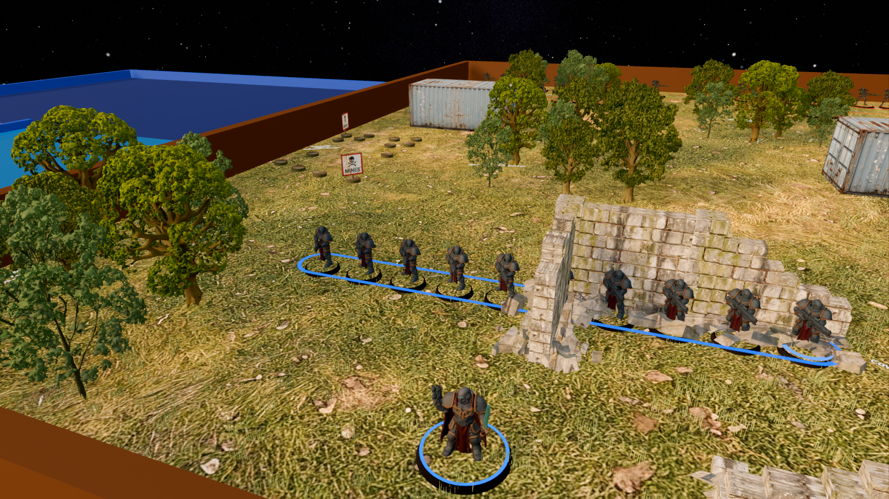
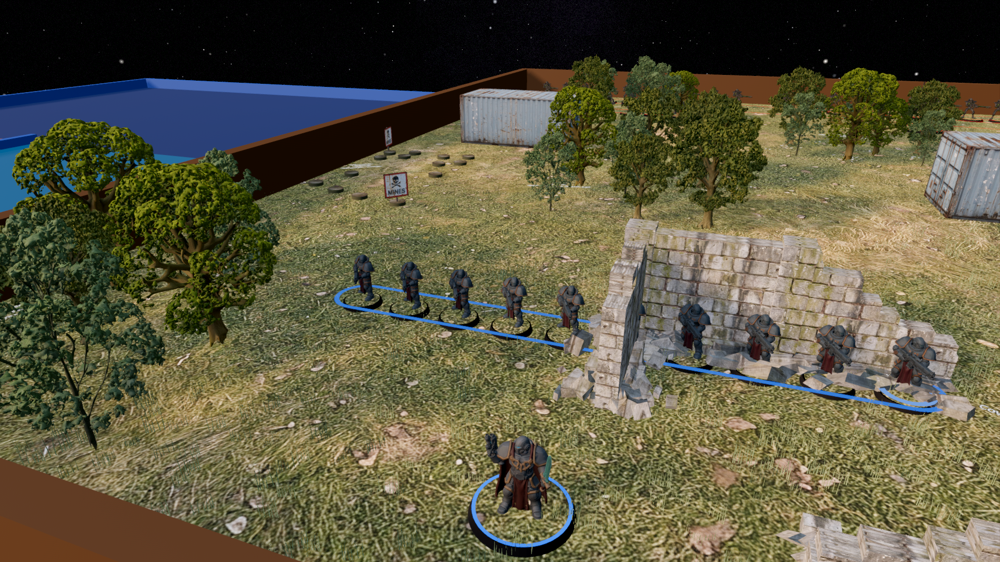
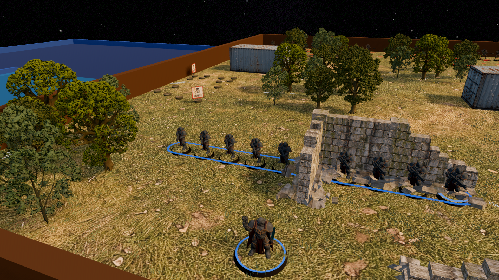
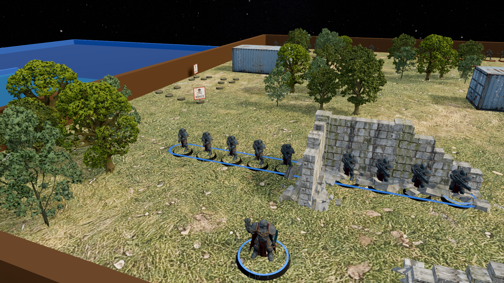

# Lighting comparison

Original, unretouched Godot viewport captures, 1920x1080, Forward+, Medium.
Baseline: c588f2ca; revised lighting: bcce0f6c. Same tutorial board and camera.
Run `tools/gfx_lighting_capture.gd`; see `docs/GRAPHICS_REVIEW.md` for conditions.

| Mood | Before | After |
|---|---|---|
| Sunset |  |  |
| Day |  |  |

Art and captures: Niemandsland, CC-BY-SA 4.0 (see `THIRD_PARTY.md`). These are
review evidence, excluded from Godot import by `.gdignore` and from game exports
by the existing `test/*` exclusion. No new game textures or models.
